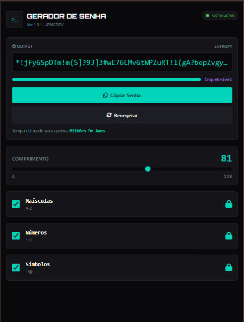
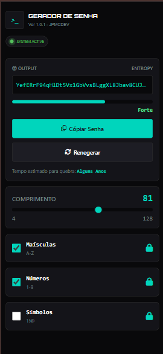

# 🔐 Gerador de Senhas


Um gerador de senhas moderno, rápido e totalmente desenvolvido com **HTML, CSS e JavaScript puro**, sem utilização de frameworks. O objetivo do projeto é criar senhas fortes e personalizadas, oferecendo uma interface intuitiva e uma experiência agradável ao usuário.

> Desenvolvido como projeto de estudos para aprofundar conhecimentos em JavaScript, manipulação do DOM e desenvolvimento Front-end.

---

## 📸 Preview

> Prints do Projeto



---

## 🚀 Demonstração

🌐 **Acesse online:**  
[Gerador de Senhas](https://jpmcdev.github.io/gerador_senha/)

---

## ✨ Funcionalidades

- ✅ Geração de senhas aleatórias
- ✅ Definição do tamanho da senha
- ✅ Inclusão de letras maiúsculas
- ✅ Inclusão de letras minúsculas
- ✅ Inclusão de números
- ✅ Inclusão de caracteres especiais
- ✅ Barra visual de força da senha
- ✅ Classificação do nível de segurança
- ✅ Tempo estimado para quebra da senha
- ✅ Botão para copiar a senha
- ✅ Interface responsiva
- ✅ Animações em CSS

---

## 🛠️ Tecnologias utilizadas

- HTML5
- CSS3
- JavaScript (ES6+)

---

## 📂 Estrutura do Projeto

```text
📦 password-generator
 ┣ 📂 assets
 ┃ ┣ 📂 css
 ┃ ┣ 📂 js
 ┃ ┗ 📂 img
 ┣ 📜 index.html
 ┗ 📜 README.md
```

---

## 🎯 Objetivos do projeto

Este projeto foi desenvolvido para praticar conceitos importantes de JavaScript, como:

- Manipulação do DOM
- Eventos
- Funções
- Arrays
- Condicionais
- Template Strings
- Organização de código
- Responsividade
- Boas práticas de Front-end

---

## 🔒 Como é calculada a força da senha?

A avaliação considera fatores como:

- Comprimento da senha
- Uso de letras maiúsculas
- Uso de números
- Uso de caracteres especiais

Com base nesses critérios, a senha recebe uma classificação de segurança e uma estimativa do tempo necessário para ser quebrada.

---

## 💻 Executando localmente

Clone o repositório:

```bash
git clone https://github.com/jpmcdev/gerador_senha.git
```

Entre na pasta:

```bash
cd gerador_senha
```

Abra o arquivo:

```text
index.html
```

ou utilize a extensão **Live Server** do VS Code.

---

## 📚 Aprendizados

Durante o desenvolvimento deste projeto foram praticados conceitos como:

- Manipulação dinâmica do HTML
- Eventos em JavaScript
- Geração aleatória de caracteres
- Estruturação de funções
- Organização de código
- CSS moderno
- Responsividade
- UX para aplicações web

---

## 👨‍💻 Autor

**João Pedro Mendes**

Desenvolvedor em formação, apaixonado por desenvolvimento web e DevOps.

GitHub: https://github.com/jpmcdev

LinkedIn: https://linkedin.com/in/jpmcavalcante/

---

## 📄 Licença

Este projeto está sob a licença MIT.

Sinta-se à vontade para utilizar, estudar e contribuir.
